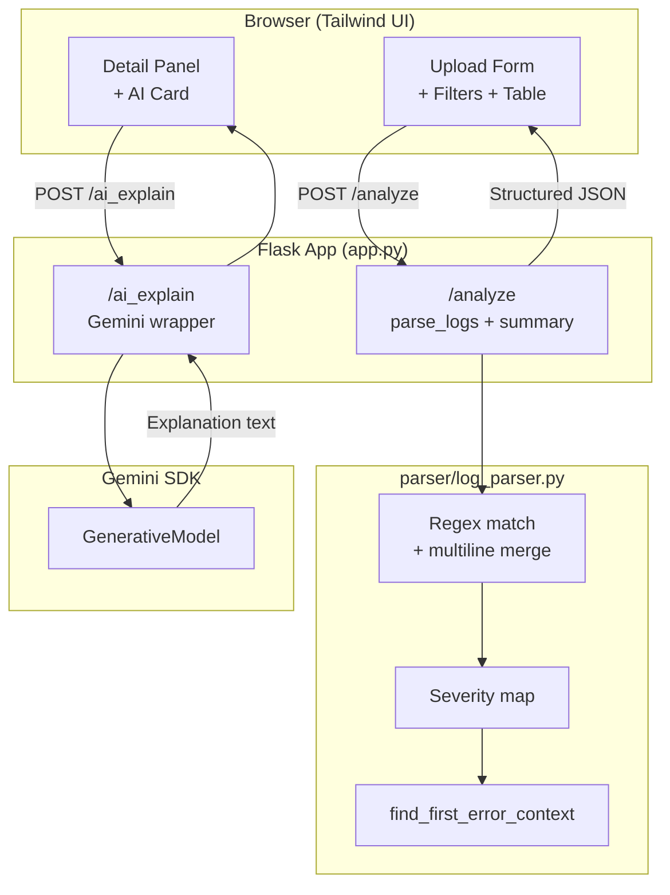

# WebSphere Log Analyser – Feynman-Friendly Walkthrough

> “What I cannot create, I do not understand.” — Richard Feynman  
This note explains how the app works as if we were teaching it to someone else. If any step feels fuzzy, we should be able to rebuild the feature from the description alone.

---

## 1. What problem are we solving?
- We receive IBM WebSphere Liberty `messages.log` files.
- Operators need to **see structured logs quickly**, **jump to the first ERROR/FATAL**, and optionally **ask Gemini AI** for a human-readable explanation.
- The tool must run locally for development but also scale easily on Cloud Run.

---

## 2. System tour (outside-in)
1. **Browser UI (templates/index.html + static files)**
   - Upload form, search/filter controls, log table, detail side panel, AI explain button, and expandable cards.
   - JavaScript (`static/script.js`) manages state, renders UI, and calls Flask APIs.
2. **Flask server (`app.py`)**
   - `/analyze`: parses uploaded logs and returns JSON with logs, summary counts, first-error snapshot, and pre-error context.
   - `/ai_explain`: sends selected log text to Gemini (if configured) and returns natural language output.
3. **Parser module (`parser/log_parser.py`)**
   - Pure functions that convert raw text into structured entries and find the first fatal/error with context.
4. **Cloud Run friendly container**
   - Dockerfile + Gunicorn entrypoint, `.env` template, and `pushtogoogle.md` deployment guide.

---

## 3. Step-by-step flow (happy path)
1. **User opens the web page.**
   - Tailwind-styled layout loads via `index.html`.
   - `static/script.js` initializes default state (empty logs, default severities, disabled AI button).

2. **User uploads `messages.log`.**
   - JS attaches file to `FormData` and POSTs `/analyze`.
   - Flask endpoint reads bytes, decodes to UTF-8, and hands the string to `parse_logs`.

3. **Parser does the heavy lifting.**
   - Splits the text line-by-line.
   - Tries two regexes that represent common Liberty patterns.
   - Normalizes severity codes (`E`, `ERR`, `SEVERE` → `ERROR`, etc.).
   - Stitches multi-line messages by appending to the previous log entry.
   - Builds `dict` objects with id/timestamp/thread/component/severity/logger/message/raw_line.

4. **Flask wraps the response.**
   - Calls `build_summary` to count severities.
   - Calls `find_first_error_context` to capture the earliest ERROR/FATAL plus a window of prior entries.
   - Returns JSON: `{ logs, summary, firstError, preErrorContext }`.

5. **UI renders the logs.**
   - JS updates state, re-renders table rows, summary badges, first-error panel, and detail pane.
   - Clicking any row highlights it and enables “Explain with AI”.

6. **(Optional) User asks for an explanation.**
   - JS POSTs `/ai_explain` with `logText`.
   - Flask checks if Gemini is configured; if not, responds with guidance text.
   - When Gemini is configured, the prompt is sent via the Google Generative AI client and the response text is returned.
   - The UI formats the markdown-like response, shows it in the card, and allows expansion into a modal.

---

## 4. Algorithms & logic blocks
### Log parsing (deterministic)
1. **Regex matching:** Two templates handle minor variations in Liberty logs. If neither matches, the line is presumed to continue the previous message.
2. **Severity normalization:** `SEVERITY_MAP` collapses the many Liberty severity variants into standard values.
3. **Timestamp parsing:** We try multiple datetime formats and fall back to the original string if none match.
4. **First-error search:** Linear scan; the first entry tagged `ERROR` or `FATAL` ends the search, and we slice the `context_window` preceding entries for context.

### AI explanation
1. **Model selection helper:** Accepts `GEMINI_MODEL` in either short (`gemini-2.5-flash`) or fully-qualified (`models/...`) format and tries both to stay compatible with API versions.
2. **Prompt template:** Constant instructions that clarify the persona (“assisting an SRE troubleshooting IBM WebSphere Liberty”) plus the raw log snippet.
3. **Error handling:** If the SDK call fails, we return a 502 with diagnostic text so the UI can inform the user.

### UI state machine
- `state.logs` holds the filtered list, `state.selectedLog` drives the detail pane, and `state.preErrorContext` populates the timeline.
- Filtering toggles a `Set` of allowed severities. Search text runs a simple `includes` filter across common fields.
- “Expand” toggles simply add/remove CSS classes; body scroll is locked when overlays are open.

---

## 5. How to rebuild from scratch (mental checklist)
1. **Set up Flask skeleton** with `/` route rendering a template and `/analyze` accepting uploads.
2. **Implement parser**: start with severity map, timestamp helper, regex loops, and context finder.
3. **Add front-end**: Tailwind container, file upload to `/analyze`, table rendering, detail pane, filters.
4. **Add AI endpoint**: optional Gemini integration, fallback message, UI button state.
5. **Wrap with production bits**: `.env`, Gunicorn entrypoint, Dockerfile, Cloud Run docs, and tests.

If each section above makes sense, we effectively “own” the system and can modify or rebuild it confidently.

---

## 6. Quick Q&A (Feynman style)
- **Q:** Why do we keep both short and long Gemini model names?  
  **A:** Different API versions expect different prefixes. Trying both prevents user error and avoids extra support questions.

- **Q:** Why is the first-error window useful?  
  **A:** Liberty logs are chronological; knowing what happened immediately before an ERROR/FATAL often reveals root cause (configuration change, prior warning, etc.).

- **Q:** What happens if a line doesn’t match our regex?  
  **A:** We assume it’s a continuation of the previous entry. Liberty wraps messages often, so collapsing them keeps context complete.

- **Q:** Why build on Flask’s dev server locally but Gunicorn in Cloud Run?  
  **A:** Flask’s built-in server is single-threaded and meant for debugging. Cloud Run needs a production WSGI server with worker management, hence Gunicorn.

Review the sections periodically; if you can explain every step aloud, you’ve mastered the code path in true Feynman fashion.

---

## 7. Visual Map (Mermaid)

